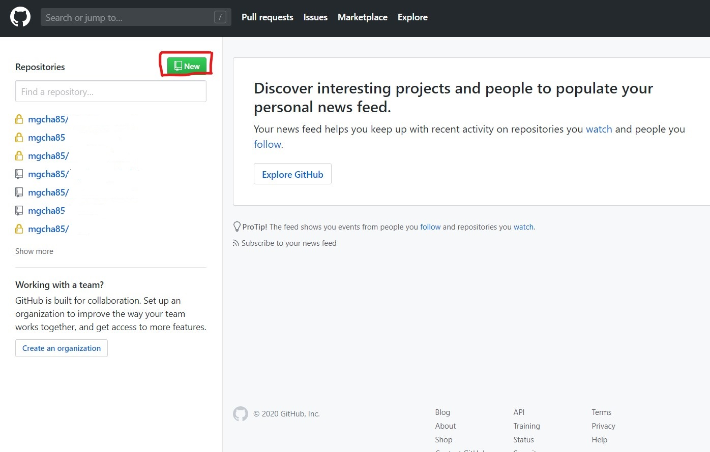
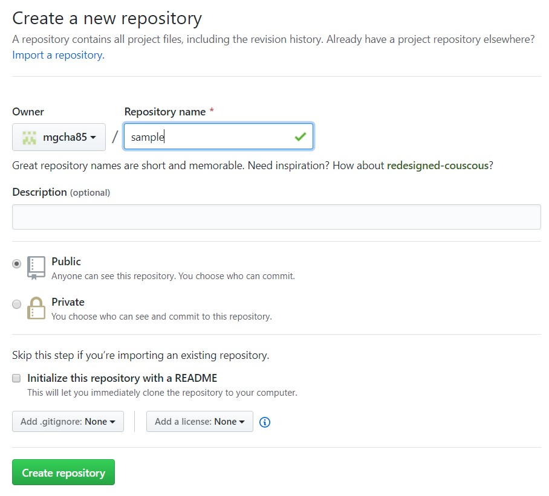
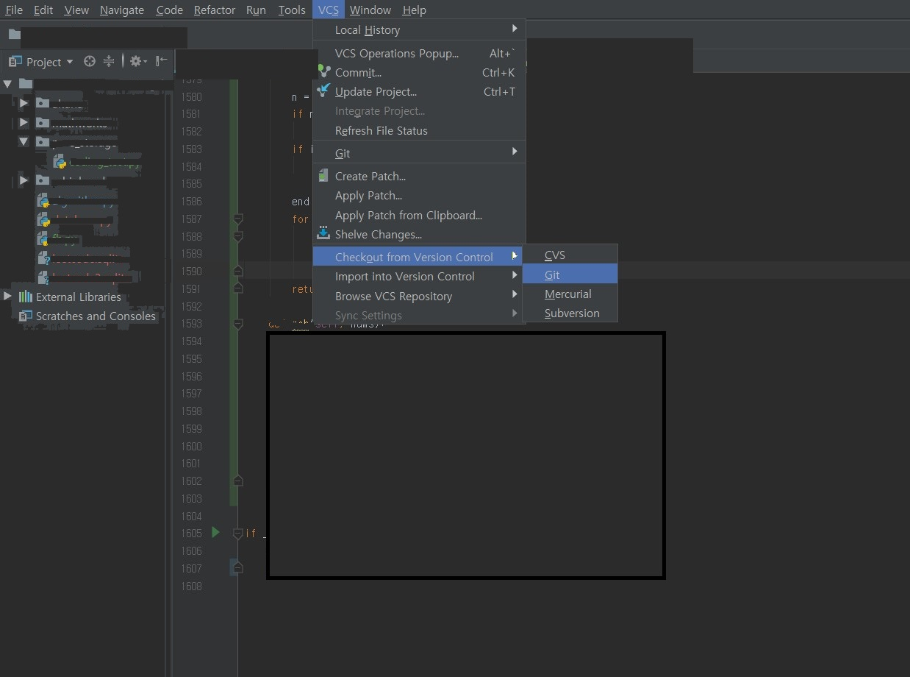
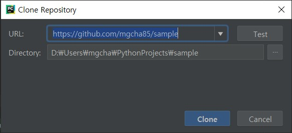
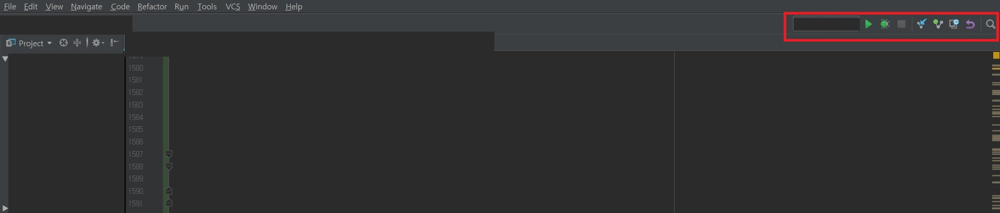

github는 프로그래머에서 정말 많은 기능을 제공해 주는 툴입니다. 
따라서 많은 프로그래머들이 사용하기도 하는데요. 
이 글을 보시는 여러분은 아마 프로그래밍을 이제 배우시거나 프로그래밍이 전공이 아니신 분들일 것입니다.
만약에 앞으로 프로그래밍을 계속 하실 예정인데 github에 대한 경험이 없으시다면 꼭 배워보시길 추천합니다.
많은 기능을 보유하고 있지만, 그중 가장 github의 기초가 되는 기능은 소스코드의 저장 및 동기화가 되겠죠.
아니면 하나의 코드를 어느 시점에서 브랜치화해서 한 코드에서 파생되는 여러 코드를 만들 수도 있습니다.
하지만, 처음으로 배우시는 분들은 일단은 동기화에 집중하시길 바라겠습니다.
동기화란 여러분이 코드를 노트북에서 개발하셔서 github에 배포를 하면 나중에 집에 있는 desktop으로 동기화를 시키면 노트북에서 개발하신 내용이 desktop으로 동기화가 됩니다.
코드를개발하다가 어디서 부터 잘못된지 잘 모를때 예전으로 돌아가는 revert를 할수도 있으며, 특정 시점으로 돌아가는 것도 가능합니다.
즉, 왠만한 코딩을 하다가 생길 수 있는 문제들을 거의 해결 해 준다고 보시면 됩니다.
또한 여러명이서 코딩을 한다고 했을때, 여러 코드가 동시에 업데이트가 된다고 하면, 업데이트 된 부분을 merge할 수도 있습니다.
github에 대한 다양한 기능은 저도 아직 완벽히 익힌것이 아니니, 설명은 여기까지 하겠습니다 ㅎㅎ
우선 github에 계정을 만드셔야 겠죠 [github](https://github.com/)에서 간단히 가입을 하시면 됩니다.

## 1. project생성
가입을 하신다면 본인의 repositories이 생깁니다. 처음 가입을 하셨다면 repositories에 아무것도 없는게 맞겠죠. 
저의 경우 여러개의 프로젝트가 있으나 그 프로젝트 이름이 사생활에 관련된 것들이여서 전부 삭제를 했습니다.
새로운 프로젝트를 생성하기 위해서 빨간 박스에 있는 new버튼을 누릅니다.

그리고 나면 아래와 같은 화면을 보실 텐데요 이때 프로젝트 이름을 넣고 (저의 경우 sample) 아래 녹색 버튼은 create repository를 누릅니다.

그러면 생성! 너무나 간단하죠. 그렇게 되면 github에서 자동으로 방금 생성한 repository를 보여줄텐데요. 이때 웹사이트의 url을 카피해둡니다.

그리고 pycharm으로 이동
아래 그림과 같이 git을 눌러줍니다.

그리고 방금 카피 하신 url을 URL에 복사! directory는 코드를 현재 PC에 저장할 곳을 가르킵니다. 전 그냥 pycharm에서 만들어주는데로 사용합니다.
그리고 clone버튼을 누르면 pycharm과 github가 연결이 됩니다.

그러면 이제 오른쪽 상단에 보시면 아래와 같은 버튼이 생성된것을 보실 수 있습니다.
아래의 빨간 박스내에 run과 debug버튼을 제외한 오른쪽 4개가 github의 버튼인데요, 그 중 첫번째가 update버튼 두 번째가 commit, 세 번째가 history를 보는것 그리고 마지막이 revert버튼입니다.
update는 github에 있는 코드를 로컬 코드와 동기화 하는것이고, commit은 로컬을 github에 올리는 것이며 나머지는 단어 뜻 그대로의 기능입니다.
아마 소스를 동기화 해본 경험이 없으신 분들은 commit자체로 바로 서버와 동기화 된다고 생각하실 수 있을실 텐데요.
commit은 제가 github서버에 업데이트 하고 싶은 부분을 설정하고 messagee를 남기는 기능이고 실제로 서버를 업데이트 하려면 push를 하셔야 합니다.
단축 버튼외의 모든 기능은 상단메뉴의 VCS에 git안에 다 있습니다.

